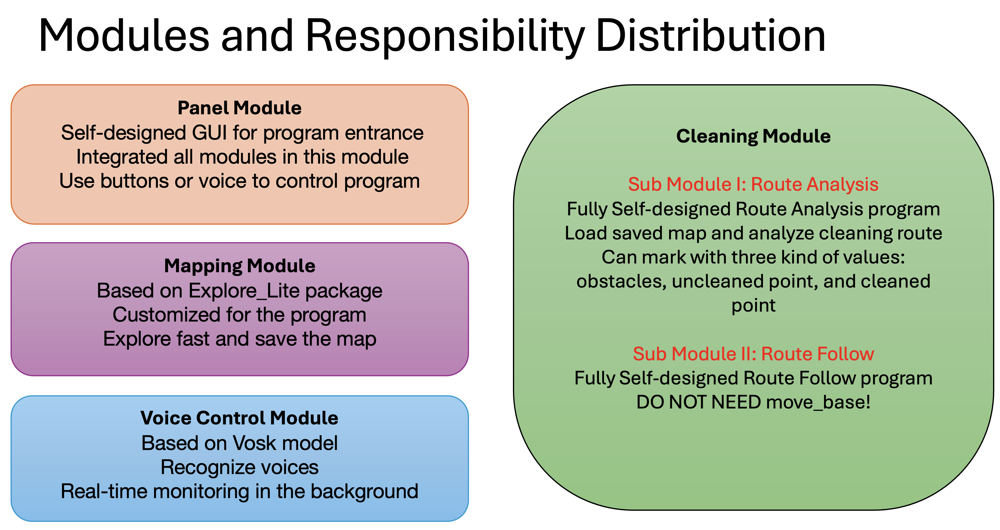
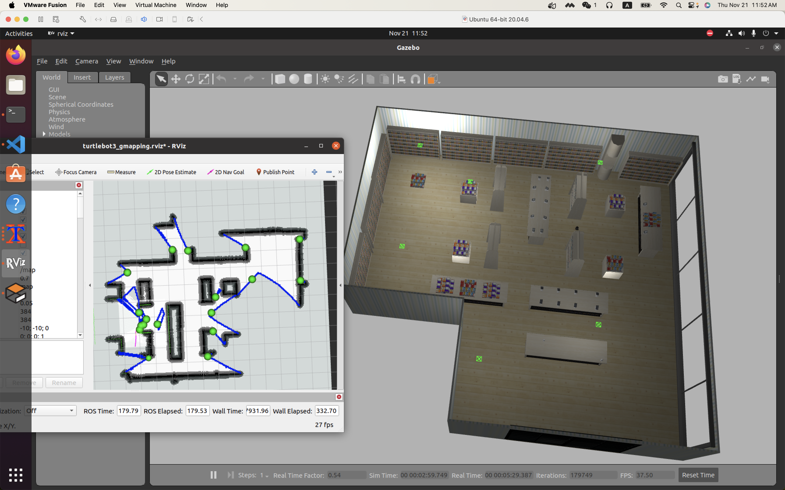
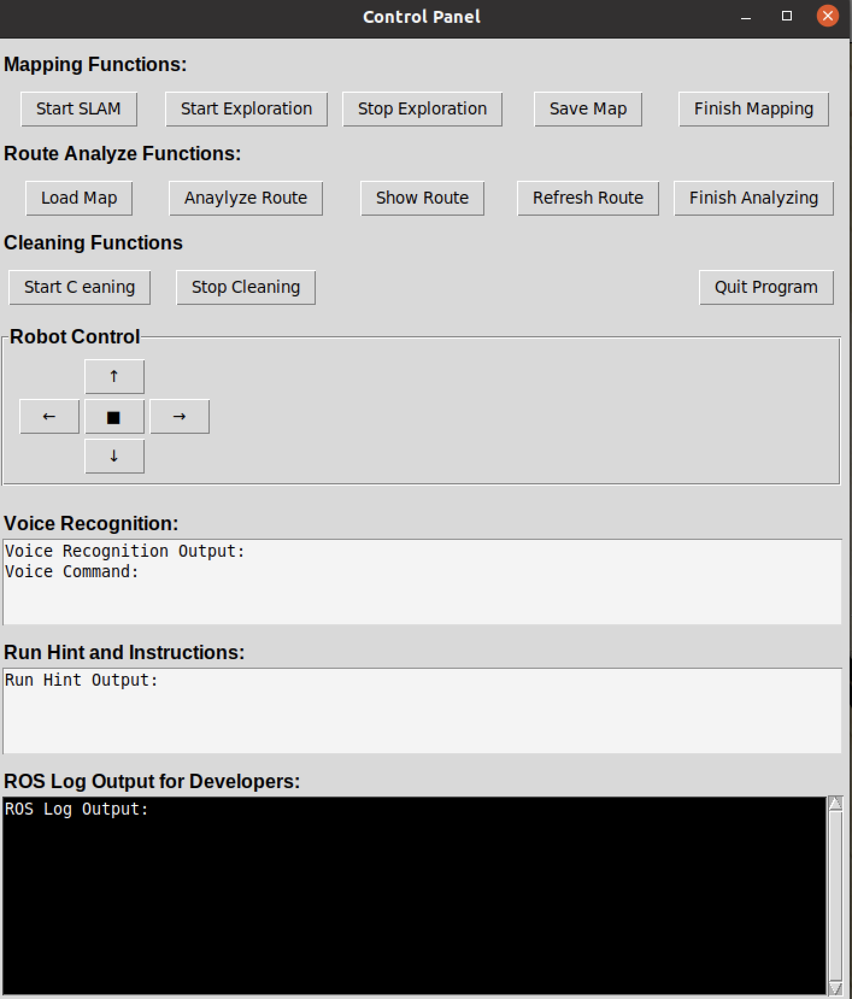
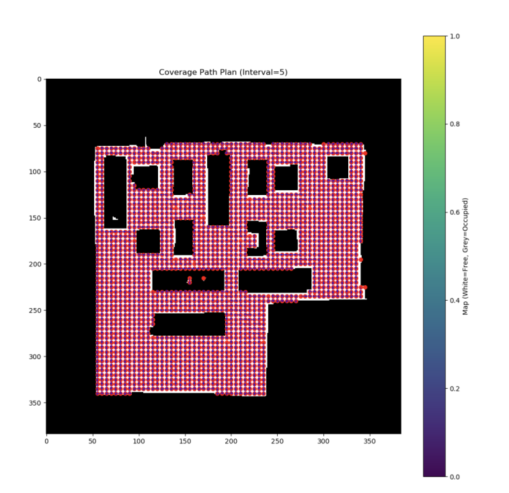
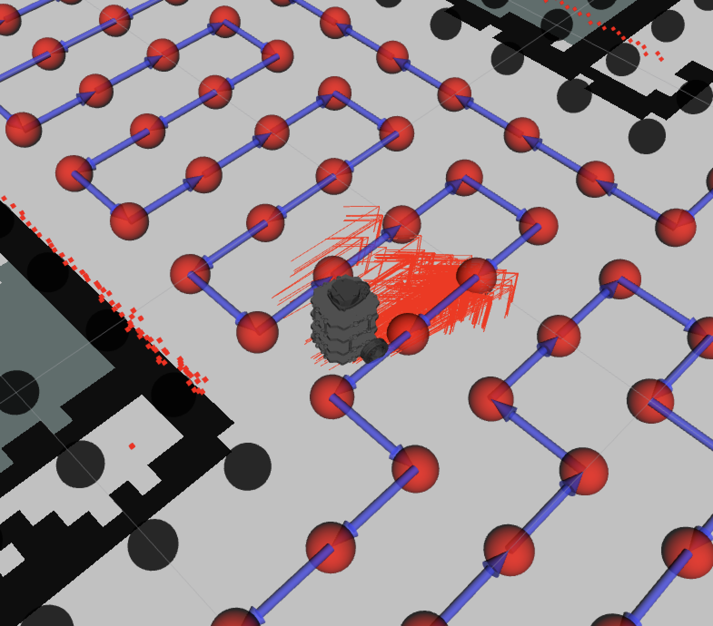
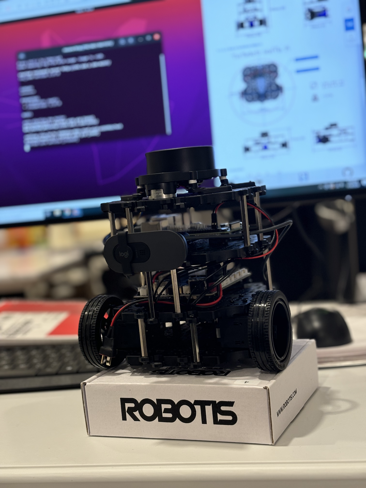
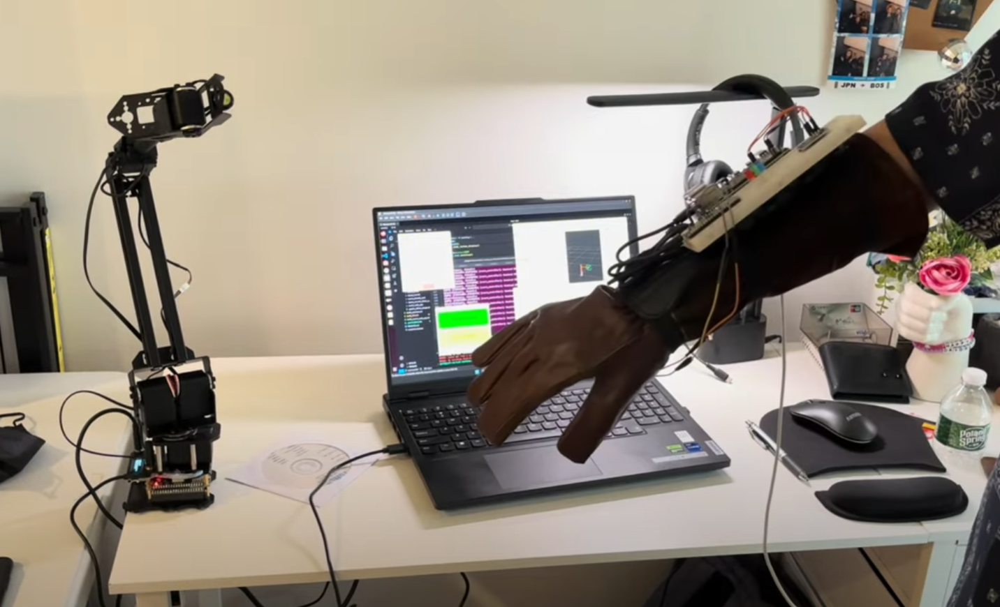
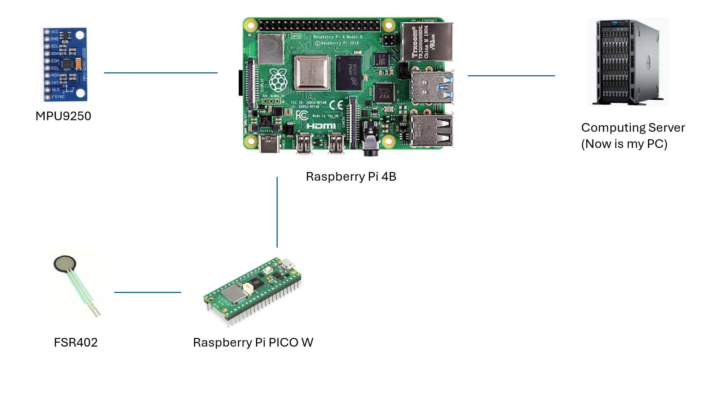
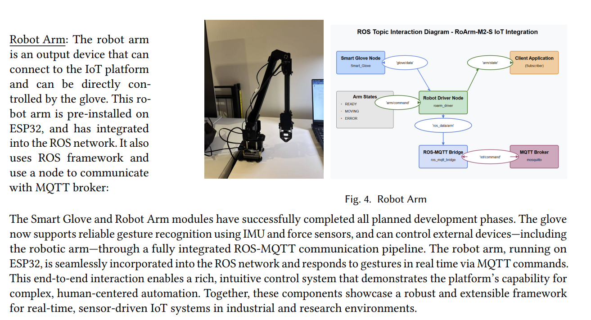

# Smart Cleaning Robot

A growing robot vacuum cleaner project, the goal is to build an open source robot vacuum cleaner project for educational learning.

## Brief Introduction and Versions

I am currently rebuilding the project to explore deeper in AI applications on cleaning robot, and adding features such as reinforcement learning; the original ROS Noetic version has been fully migrated to the [noetic branch](https://github.com/jeffliulab/SmartCleaningRobot/tree/noetic). See details in following introductions.

### Main Branch (ROS Humble & Isaac Lab)

To explore deeper in Reinforcement Learning, I create this whole new main branch in ROS Humble, with Isaac Lab, to explore reinforcement learning in cleaning robot tasks.

### ROS Noetic Branch (Origin System)

Noetic branch is based on ROS Noetic, Gazebo, RViz, and traditional control algorithms. You can find details in [noetic branch](https://github.com/jeffliulab/SmartCleaningRobot/tree/noetic).

Noetic Version Demos: (including exploration, mapping, cleaning, ..)

- Real Demo Link: https://youtu.be/zmo8CKolIh4?si=pPlF57XZn4DD5oo9
- Sim Demo Link: https://youtu.be/rqXiXsVubhQ?si=3jIF6Q37Kqr45SRk

Mapping:

Control Panel:

Planning:

Hardware Platform:

### Smart Glove Branch

This is a branch ([repo: SmartGlove](https://github.com/jeffliulab/SmartGlove?tab=readme-ov-file)) focus on smart glove, which can control robot arm and experimentally connect into a self-designed IoT platform.

Hardware implementations:

ROS topics:

Robot arm:

## Furthermore

### Future Plans

Based on previous work, in this new project, I will add following feature:

* Intelligent Agent built in edge device, use Jetson Nano to increase the power.
* DIY exploration and mapping module
* Update cleaning module
* New control panel based on phone
* Connect with other IoT devices

### Relevant Literature and References

This project originated in the Brandeis Robotics Lab and was conducted under the guidance of Professor Pito Salas.

Related research, tutorial and reference for algorithms:

- Frontier Based Exploration: chrome-extension://efaidnbmnnnibpcajpcglclefindmkaj/https://arxiv.org/pdf/1806.03581
- Dilation Algorithm: https://homepages.inf.ed.ac.uk/rbf/HIPR2/dilate.htm
- Greedy Algorithm: https://en.wikipedia.org/wiki/Greedy_algorithm
- Bresenham's Line Algorithm: https://en.wikipedia.org/wiki/Bresenham%27s_line_algorithm
- Mapping, localization and planning: chrome-extension://efaidnbmnnnibpcajpcglclefindmkaj/https://gaoyichao.com/Xiaotu/resource/refs/PR.MIT.en.pdf

Technical reference for integration and structures:

- ROS Frontier Exploration: https://wiki.ros.org/frontier_exploration
- ROS Explore Lite: https://wiki.ros.org/explore_lite
- VOSK: https://alphacephei.com/vosk/
- ROS Full Coverage Path Planning: https://wiki.ros.org/full_coverage_path_planner
- Turtlebot3: https://emanual.robotis.com/
- OpenCV: https://opencv.org/
